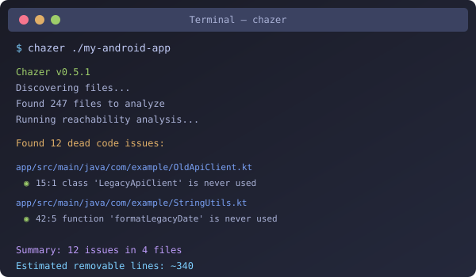

<div align="center">


# Chazer 
(formerly SearchDeadCode)

**Find and eliminate dead code in Android projects**

[](https://blog.rust-lang.org/2025/12/11/Rust-1.92.0/)
[](https://github.com/marketplace/actions/chazer)
[](https://opensource.org/licenses/MIT)

A blazingly fast CLI tool written in Rust to detect and safely remove dead/unused code in Android projects (Kotlin &
Java).

Inspired by [Periphery](https://github.com/peripheryapp/periphery) for Swift.



*See it in action: analyze an Android project in seconds*

<!-- To generate an animated GIF demo: vhs demo.tape -->

</div>

## 📋 Table of Contents

- [Features](#-features)
- [Comparison with Alternatives](#-comparison-with-alternatives)
- [Installation](#-installation)
- [Quick Start](#-quick-start)
- [CLI Reference](#-cli-reference)
- [Configuration](#-configuration)
- [Detection Types](#-detection-types)
- [When NOT to Use Chazer](#-when-not-to-use-chazer)
- [Troubleshooting](#-troubleshooting)
- [Contributing](#-contributing)

## ✨ Features

### Detection Capabilities

| Category          | Detection                                                                                  |
|-------------------|--------------------------------------------------------------------------------------------|
| **Core**          | Unused classes, interfaces, methods, functions, properties, fields, imports                |
| **Advanced**      | Unused parameters, enum cases, type aliases                                                |
| **Smart**         | Assign-only properties (written but never read), dead branches, redundant public modifiers |
| **Android-Aware** | Respects Activities, Fragments, XML layouts, Manifest entries as entry points              |
| **Resources**     | Unused Android resources (strings, colors, dimens, styles, attrs)                          |

### Safe Delete

- **Interactive mode**: Confirm each deletion individually
- **Batch mode**: Review all candidates, confirm once
- **Dry-run**: Preview what would be deleted
- **Undo support**: Generate restore scripts

## 📊 Comparison with Alternatives

How does Chazer compare to other tools?

| Feature                  |  Chazer   | Android Lint |  R8/ProGuard  |  Detekt   |   IntelliJ    |
|--------------------------|:-----------------:|:------------:|:-------------:|:---------:|:-------------:|
| **Speed**                |  ⚡ <1s/1k files   |   🐢 Slow    | 🔨 Build-time | 🐢 Medium |   🐢 Medium   |
| **Kotlin-first**         |     ✅ Native      |  ⚠️ Partial  |     ✅ Yes     |   ✅ Yes   |     ✅ Yes     |
| **Java support**         |       ✅ Yes       |    ✅ Yes     |     ✅ Yes     |   ❌ No    |     ✅ Yes     |
| **Safe delete**          |   ✅ Interactive   |     ❌ No     |     ❌ No      |   ❌ No    |  ✅ IDE only   |
| **CI/CD ready**          |   ✅ SARIF, JSON   |    ✅ XML     |     ❌ No      |  ✅ SARIF  |     ❌ No      |
| **Coverage integration** |  ✅ JaCoCo, Kover  |     ❌ No     |     ❌ No      |   ❌ No    |     ❌ No      |
| **Cycle detection**      |   ✅ Zombie code   |     ❌ No     |     ❌ No      |   ❌ No    |     ❌ No      |
| **Resource detection**   |       ✅ Yes       |    ✅ Yes     |     ❌ No      |   ❌ No    |     ✅ Yes     |
| **Config file**          |    ✅ YAML/TOML    |    ✅ XML     |  ✅ ProGuard   |  ✅ YAML   |     ❌ No      |
| **Standalone**           | ✅ No build needed |   ❌ Gradle   |    ❌ Build    | ❌ Gradle  |     ❌ IDE     |
| **Open source**          |       ✅ MIT       |   ✅ Apache   | ❌ Proprietary | ✅ Apache  | ❌ Proprietary |

### When to Use Each Tool

| Tool               | Best For                                                                      |
|--------------------|-------------------------------------------------------------------------------|
| **Chazer** | Fast CI checks, pre-commit hooks, quick project audits, Kotlin-first projects |
| **Android Lint**   | Comprehensive Android-specific checks beyond dead code                        |
| **R8/ProGuard**    | Production builds with 100% accuracy (but no interactive deletion)            |
| **Detekt**         | Kotlin code style and complexity analysis                                     |
| **IntelliJ**       | Interactive development with refactoring support                              |

**Pro tip**: Use Chazer for fast feedback during development, then validate with R8's `usage.txt` before major
cleanups.

## ⚡ Performance

Target performance goals (achieved):

| Codebase Size | Parse Time | Analysis Time |
|---------------|------------|---------------|
| 1,000 files   | < 1s       | < 0.5s        |
| 10,000 files  | < 5s       | < 2s          |
| 100,000 files | < 30s      | < 10s         |

## 📦 Installation

### Via Homebrew (macOS/Linux)

```bash
brew tap dr7ro0t/tap
brew install chazer
```

### Via Cargo

```bash
cargo install chazer
```

### Pre-built Binaries

Download the latest release from [GitHub Releases](https://github.com/dr7ro0t/Chazer/releases).

Available binaries:

- `chazer-linux-x86_64` - Linux (Intel/AMD 64-bit)
- `chazer-linux-aarch64` - Linux (ARM 64-bit)
- `chazer-macos-x86_64` - macOS (Intel)
- `chazer-macos-aarch64` - macOS (Apple Silicon)
- `chazer-windows-x86_64.exe` - Windows (64-bit)

#### macOS: Bypass Gatekeeper Warning

macOS may show a security warning because the binary isn't code-signed. To run it:

**Option 1: Remove quarantine attribute (recommended)**

```bash
xattr -d com.apple.quarantine ~/Downloads/chazer-macos-*
chmod +x ~/Downloads/chazer-macos-*
```

**Option 2: Right-click → Open**

- Right-click the binary in Finder
- Select "Open" from the context menu
- Click "Open" in the dialog

**Option 3: System Preferences**

- Go to System Preferences → Privacy & Security
- Click "Open Anyway" next to the blocked app message

### From Source

```bash
git clone https://github.com/dr7ro0t/Chazer
cd Chazer
cargo install --path .
```

## 🚀 Quick Start

```bash
# Analyze your Android project
chazer ./my-android-app

# Preview what would be deleted
chazer ./my-android-app --delete --dry-run
```

### Example Output

```
$ chazer ./my-app --min-confidence high

Chazer v0.4.0
Discovering files...
Found 247 files to analyze
Parsing files...
Detecting entry points...
Found 89 entry points
Running reachability analysis...
Reachability: 1,847 reachable, 2,103 total

Found 12 dead code issues:

Confidence Legend:
  ● Confirmed (runtime) ◉ High ○ Medium ◌ Low

app/src/main/java/com/example/data/OldApiClient.kt
  ◉ 15:1 warning [DC001] class 'LegacyApiClient' is never used
    → class 'LegacyApiClient'

app/src/main/java/com/example/utils/StringUtils.kt
  ◉ 42:5 warning [DC001] function 'formatLegacyDate' is never used
    → function 'formatLegacyDate'
  ◉ 67:5 warning [DC001] function 'parseOldFormat' is never used
    → function 'parseOldFormat'

app/src/main/java/com/example/models/User.kt
  ◉ 23:5 warning [DC004] property 'middleName' is never used
    → property 'middleName'

Summary: 12 issues in 4 files (3 classes, 5 functions, 4 properties)
Estimated removable lines: ~340
```

## 📖 CLI Reference

```
chazer [OPTIONS] [PATH]

Arguments:
  [PATH]  Path to the project directory to analyze [default: .]

Options:
  -c, --config <FILE>      Path to configuration file
  -t, --target <DIR>       Target directories to analyze (can be repeated)
  -e, --exclude <PATTERN>  Patterns to exclude (can be repeated)
  -r, --retain <PATTERN>   Patterns to retain as entry points (can be repeated)
  -f, --format <FORMAT>    Output format [default: terminal]
                           [possible values: terminal, json, sarif]
  -o, --output <FILE>      Output file for json/sarif formats
      --delete             Enable safe delete mode
      --interactive        Interactive deletion (confirm each item)
      --dry-run            Preview deletions without making changes
      --undo-script <FILE> Generate undo/restore script
      --detect <TYPES>     Detection types (comma-separated)

  Analysis Options:
      --deep                  Deep analysis mode - analyzes individual members
                              within classes for more aggressive detection
      --unused-params         Detect unused function parameters
      --unused-resources      Detect unused Android resources (strings, colors, etc.)

  Hybrid Analysis Options:
      --coverage <FILE>       Coverage file (JaCoCo XML, Kover XML, or LCOV)
                              Can be specified multiple times for merged coverage
      --proguard-usage <FILE> ProGuard/R8 usage.txt file for enhanced detection
      --min-confidence        Minimum confidence level to report
                              [possible values: low, medium, high, confirmed]
      --runtime-only          Only show findings confirmed by runtime coverage
      --include-runtime-dead  Include reachable but never-executed code
      --detect-cycles         Detect zombie code cycles (mutually dependent dead code)

  -v, --verbose            Verbose output
  -q, --quiet              Quiet mode - only output results
  -h, --help               Print help
  -V, --version            Print version
```

### Complete Command Examples

```bash
# Basic analysis
chazer /path/to/android/project

# Deep analysis (more aggressive, analyzes individual members)
chazer ./app --deep

# With exclusions
chazer ./app \
  --exclude "**/build/**" \
  --exclude "**/test/**" \
  --exclude "**/generated/**"

# Full hybrid analysis (static + dynamic + R8)
chazer ./app \
  --deep \
  --coverage build/reports/jacoco.xml \
  --proguard-usage app/build/outputs/mapping/release/usage.txt \
  --detect-cycles \
  --min-confidence high

# JSON output for CI/CD
chazer ./app \
  --format json \
  --output dead-code-report.json

# SARIF for GitHub Code Scanning
chazer ./app \
  --format sarif \
  --output results.sarif

# Safe delete with dry-run preview
chazer ./app --delete --dry-run

# Detect unused Android resources
chazer ./app --unused-resources

# Detect unused function parameters
chazer ./app --unused-params

# Full analysis with all enhanced detection
chazer ./app \
  --deep \
  --unused-params \
  --unused-resources \
  --detect-cycles

# Interactive deletion with undo script
chazer ./app \
  --delete \
  --interactive \
  --undo-script restore.sh

# Only show confirmed dead code (highest confidence)
chazer ./app \
  --coverage coverage.xml \
  --proguard-usage usage.txt \
  --runtime-only \
  --min-confidence confirmed
```

### Shell Completions

Generate tab completions for your shell:

```bash
# Bash
chazer --completions bash > ~/.local/share/bash-completion/completions/chazer

# Zsh
chazer --completions zsh > ~/.zfunc/_chazer

# Fish
chazer --completions fish > ~/.config/fish/completions/chazer.fish
```

## 🔄 CI/CD Integration

You can easily add dead code detection to your CI pipeline

### GitHub Actions

```yaml
# .github/workflows/dead-code.yml
name: Dead Code Detection

on: [ push, pull_request ]

jobs:
  dead-code:
    runs-on: ubuntu-latest
    steps:
      - uses: actions/checkout@v4

      - name: Detect Dead Code
        uses: dr7ro0t/Chazer@v0
        with:
          path: '.'
          fail-on-findings: 'true'    # Fail CI on dead code
          min-confidence: 'medium'
          format: 'sarif'             # SARIF output for GitHub Security
          output: 'dead-code.sarif'
          args: '--deep --unused-params --write-only --sealed-variants'  # Deep analysis with all detectors
```

#### Action Inputs

| Input              | Description                                              | Default    |
|--------------------|----------------------------------------------------------|------------|
| `path`             | Path to analyze                                          | `.`        |
| `version`          | Chazer version                                   | `latest`   |
| `format`           | Output format: `terminal`, `json`, `sarif`               | `terminal` |
| `output`           | Output file path                                         | -          |
| `args`             | Additional CLI arguments                                 | -          |
| `fail-on-findings` | Fail if dead code found                                  | `false`    |
| `min-confidence`   | Minimum confidence: `low`, `medium`, `high`, `confirmed` | `medium`   |

### GitLab CI

```yaml
deadcode:
  stage: analyze
  script:
    - cargo install chazer
    - chazer . --format json --output deadcode.json
  artifacts:
    paths:
      - deadcode.json
```

## ⚙️ Configuration

### Configuration File

Chazer looks for configuration in these locations (in order):

1. Path specified via `--config` flag
2. `.deadcode.yml` / `.deadcode.yaml` in project root
3. `.deadcode.toml` in project root
4. `deadcode.yml` / `deadcode.yaml` / `deadcode.toml` in project root

### YAML Configuration Example

```yaml
# .deadcode.yml

# Directories to analyze (relative to project root)
targets:
  - "app/src/main/kotlin"
  - "app/src/main/java"
  - "feature/src/main/kotlin"
  - "core/src/main/kotlin"

# Patterns to exclude from analysis (glob syntax)
exclude:
  - "**/generated/**"      # Generated code
  - "**/build/**"          # Build outputs
  - "**/.gradle/**"        # Gradle cache
  - "**/.idea/**"          # IDE files
  - "**/test/**"           # Test files (see note below)
  - "**/*Test.kt"          # Test classes
  - "**/*Spec.kt"          # Spec classes

# Patterns to retain - never report as dead (glob syntax)
# Use for code accessed via reflection, external libraries, etc.
retain_patterns:
  - "*Adapter"             # RecyclerView adapters
  - "*ViewHolder"          # ViewHolders
  - "*Callback"            # Callback interfaces
  - "*Listener"            # Event listeners
  - "*Binding"             # View bindings

# Explicit entry points (fully qualified class names)
entry_points:
  - "com.example.app.MainActivity"
  - "com.example.app.MyApplication"
  - "com.example.api.PublicApi"

# Report configuration
report:
  format: "terminal"       # terminal | json | sarif
  group_by: "file"         # file | type | severity
  show_code: true          # Show code snippets in output

# Detection configuration - enable/disable specific detectors
detection:
  unused_class: true       # Unused classes and interfaces
  unused_method: true      # Unused methods and functions
  unused_property: true    # Unused properties and fields
  unused_import: true      # Unused import statements
  unused_param: true       # Unused function parameters
  unused_enum_case: true   # Unused enum values
  assign_only: true        # Write-only properties
  dead_branch: true        # Unreachable code branches
  redundant_public: true   # Public members only used internally

# Android-specific configuration
android:
  parse_manifest: true           # Parse AndroidManifest.xml for entry points
  parse_layouts: true            # Parse layout XMLs for class references
  auto_retain_components: true   # Auto-retain Android lifecycle components
  component_patterns: # Additional patterns to auto-retain
    - "*Activity"
    - "*Fragment"
    - "*Service"
    - "*BroadcastReceiver"
    - "*ContentProvider"
    - "*ViewModel"
    - "*Application"
    - "*Worker"                  # WorkManager workers
```

### TOML Configuration Example

```toml
# .deadcode.toml

targets = [
    "app/src/main/kotlin",
    "app/src/main/java",
]

exclude = [
    "**/generated/**",
    "**/build/**",
    "**/test/**",
]

retain_patterns = [
    "*Adapter",
    "*ViewHolder",
]

entry_points = [
    "com.example.app.MainActivity",
]

[report]
format = "terminal"
group_by = "file"
show_code = true

[detection]
unused_class = true
unused_method = true
unused_property = true
unused_import = true
unused_param = true
unused_enum_case = true
assign_only = true
dead_branch = true
redundant_public = true

[android]
parse_manifest = true
parse_layouts = true
auto_retain_components = true
component_patterns = [
    "*Activity",
    "*Fragment",
    "*ViewModel",
]
```

## 🎯 Detection Types

### Common

#### 1. Unused Classes/Interfaces

Classes or interfaces that are never instantiated, extended, or referenced.

```kotlin
// DEAD: Never used anywhere
class OrphanHelper {
    fun doSomething() {}
}
```

#### 2. Unused Methods/Functions

Methods that are never called, including extension functions.

```kotlin
class UserService {
    fun getUser(id: String) = // used

    // DEAD: Never called
    fun legacyGetUser(id: Int) = // ...
}

// Extension functions are also detected
fun String.deadExtension(): String = this  // DEAD: Never called
```

#### 3. Unused Properties/Fields

Properties declared but never read.

```kotlin
class Config {
    val apiUrl = "https://api.example.com"  // used
    val debugMode = true                     // DEAD: never read
}
```

#### 4. Assign-Only Properties

Properties that are written to but never read.

```kotlin
class Analytics {
    var lastEventTime: Long = 0  // DEAD: assigned but never read

    fun track(event: Event) {
        lastEventTime = System.currentTimeMillis()  // write-only
        send(event)
    }
}
```

#### 5. Unused Parameters

Function parameters that are never used in the body.

```kotlin
// DEAD: 'context' parameter never used
fun formatDate(date: Date, context: Context): String {
    return SimpleDateFormat("yyyy-MM-dd").format(date)
}
```

#### 6. Unused Imports

Import statements with no corresponding usage.

```kotlin
import com.example.utils.StringUtils  // DEAD: never used
import com.example.models.User        // used

class UserProfile {
    fun display(user: User) {}
}
```

#### 7. Unused Enum Cases

Individual enum values that are never referenced.

```kotlin
enum class Status {
    ACTIVE,     // used
    INACTIVE,   // used
    LEGACY,     // DEAD: never referenced
    DEPRECATED  // DEAD: never referenced
}
```

#### 8. Redundant Public Modifiers

Public declarations only used within the same module.

```kotlin
// DEAD visibility: only used internally, could be internal/private
public class InternalHelper {
    public fun process() {}  // only called within this module
}
```

#### 9. Dead Branches

Code paths that can never be executed.

```kotlin
fun process(value: Int) {
    if (value > 0) {
        // reachable
    } else if (value <= 0) {
        // reachable
    } else {
        // DEAD: impossible to reach
        handleImpossible()
    }
}
```

### Android-Specific Handling

#### Auto-Retained Entry Points

The tool automatically retains (never reports as dead):

| Category                 | Patterns / Annotations                                                                                                                                                                                  |
|--------------------------|---------------------------------------------------------------------------------------------------------------------------------------------------------------------------------------------------------|
| **Lifecycle Components** | `*Activity`, `*Fragment`, `*Service`, `*BroadcastReceiver`, `*ContentProvider`, `*Application`                                                                                                          |
| **Jetpack Compose**      | `@Composable`, `@Preview`                                                                                                                                                                               |
| **ViewModels**           | `*ViewModel`, `@HiltViewModel`                                                                                                                                                                          |
| **Dependency Injection** | `@Inject`, `@Provides`, `@Binds`, `@BindsOptionalOf`, `@BindsInstance`, `@IntoMap`, `@IntoSet`, `@Module`, `@Component`, `@HiltAndroidApp`, `@AndroidEntryPoint`, `@AssistedInject`, `@AssistedFactory` |
| **Serialization**        | `@Serializable`, `@Parcelize`, `@JsonClass`, `@Entity`, `@SerializedName`, `@SerialName`                                                                                                                |
| **Data Binding**         | `@BindingAdapter`, `@InverseBindingAdapter`, `@BindingMethod`, `@BindingMethods`, `@BindingConversion`                                                                                                  |
| **Room Database**        | `@Dao`, `@Database`, `@Query`, `@Insert`, `@Update`, `@Delete`, `@RawQuery`, `@Transaction`, `@TypeConverter`                                                                                           |
| **Retrofit**             | `@GET`, `@POST`, `@PUT`, `@DELETE`, `@PATCH`, `@HEAD`, `@OPTIONS`, `@HTTP`, `@Path`, `@Body`, `@Field`, `@Header`                                                                                       |
| **Testing**              | `@Test`, `@Before`, `@After`, `@BeforeEach`, `@AfterEach`, `@BeforeAll`, `@AfterAll`, `@ParameterizedTest`, `@RunWith`                                                                                  |
| **Reflection**           | `@JvmStatic`, `@JvmOverloads`, `@JvmField`, `@JvmName`, `@Keep`                                                                                                                                         |
| **WorkManager**          | `@HiltWorker`                                                                                                                                                                                           |
| **Lifecycle**            | `@OnLifecycleEvent`                                                                                                                                                                                     |
| **Koin DI**              | `@Factory`, `@Single`, `@KoinViewModel`                                                                                                                                                                 |
| **Event Bus**            | `@Subscribe`                                                                                                                                                                                            |
| **Coroutines**           | `suspend` functions (in reachable classes), `@FlowPreview`, `@ExperimentalCoroutinesApi`                                                                                                                |
| **Entry Functions**      | `main()` functions                                                                                                                                                                                      |

#### XML Parsing

The tool parses Android XML files to detect additional entry points:

**AndroidManifest.xml**

- `<activity android:name=".MainActivity">`
- `<service android:name=".MyService">`
- `<receiver>`, `<provider>`, `<application>` components

**Layout XMLs** (`res/layout/*.xml`)

- Custom views: `<com.example.CustomView>`
- Context references: `tools:context=".MyActivity"`
- Data binding: `app:viewModel="@{viewModel}"`

### 🧪 Test Code Handling

Code that is **only** used in tests is considered dead code. This is intentional because:

1. Test-only utilities should be in test directories
2. Production code shouldn't exist solely for testing
3. Such code adds maintenance burden without production value

To exclude test files from analysis:

```yaml
exclude:
  - "**/test/**"
  - "**/androidTest/**"
  - "**/*Test.kt"
  - "**/*Spec.kt"
```

## 🚫 When NOT to Use Chazer

Being honest about limitations helps you choose the right tool. **Don't use Chazer if:**

### ❌ You Need 100% Accuracy

Static analysis cannot catch everything. If you need guaranteed accuracy:

- Use R8/ProGuard's `usage.txt` output (generated during release builds)
- Chazer can validate against `usage.txt` with `--proguard-usage`

### ❌ Heavy Reflection Usage

If your codebase relies heavily on reflection:

```kotlin
// We can't detect this as "used"
Class.forName("com.example.MyClass").newInstance()
```

**Workaround**: Add reflection targets to `retain_patterns` in your config.

### ❌ Pure Java Projects

Chazer is Kotlin-first. While Java is supported, it shines on:

- Kotlin projects
- Mixed Kotlin/Java Android projects

For pure Java, consider [UCDetector](https://ucdetector.org/) or IntelliJ's built-in inspections.

### ❌ You Want IDE Integration

Chazer is a CLI tool. If you prefer IDE integration:

- Use IntelliJ/Android Studio's built-in "Unused declaration" inspection
- Or run Chazer in watch mode alongside your IDE

### ❌ Dynamic Languages / KMP JS Target

We analyze JVM bytecode patterns. JavaScript or other dynamic targets aren't supported.

### ✅ But DO Use Chazer If You Want:

- **Speed**: Analyze 10k files in seconds, not minutes
- **CI Integration**: Block PRs that add dead code
- **Safe Deletion**: Interactive mode with undo scripts
- **Coverage Integration**: Combine static + dynamic analysis
- **No Build Required**: Analyze without compiling

### Known Limitations

1. **Reflection**: Code accessed via reflection (e.g., `Class.forName()`) cannot be detected as used. Use
   `retain_patterns` for such cases.

2. **Multi-module Projects**: Each module is analyzed independently. Cross-module references work but require all
   modules to be in the analysis path.

3. **Annotation Processors**: Generated code (Dagger, Room, etc.) should be excluded as it may reference declarations in
   ways not visible to static analysis. However, the tool now properly recognizes most DI annotations (`@Provides`,
   `@Binds`, `@Query`, etc.) as entry points.

4. **`const val` Inlining**: Kotlin compile-time constants are inlined by the compiler. The tool now automatically skips
   `const val` properties to avoid false positives.

5. **ProGuard Keep Rules**: The tool doesn't parse ProGuard `-keep` rules. Use `retain_patterns` for kept classes, or
   verify against usage.txt output.

6. **R.* Resource References**: Android resource references (`R.drawable.*`, `R.string.*`, etc.) are compile-time
   constants and don't create trackable references in the code graph.

## 🔧 Troubleshooting

### "No Kotlin or Java files found"

- Check that your target path is correct
- Ensure files aren't excluded by `.gitignore` or `--exclude` patterns
- Verify the project structure has `.kt` or `.java` files

### False Positives

If code is incorrectly reported as dead:

1. **Check entry points**: Add to `entry_points` in config
2. **Check patterns**: Add to `retain_patterns` for reflection/framework usage
3. **Check annotations**: Ensure framework annotations are recognized
4. **Check XML**: Verify AndroidManifest.xml and layouts are being parsed

```yaml
# Common false positive fixes
retain_patterns:
  - "*Adapter"           # RecyclerView adapters
  - "*ViewHolder"        # ViewHolders
  - "*Callback"          # Callback interfaces
  - "*Binding"           # Generated bindings
  - "Dagger*"            # Dagger components
```

### Extension Functions Named `<anonymous>`

This was fixed in v0.1.0. If you see this, ensure you're using the latest version.

### Generic Types Not Matching

Generic type references like `Foo<Bar>` now correctly match declarations `Foo`. This was fixed in v0.1.0.

### Glob Patterns Matching Wrong Paths

Patterns like `**/test/**` now only match complete directory names, not substrings. `/test/` matches, but
`/testproject/` does not.

## 🤝 Contributing

Contributions are welcome! Please:

1. Fork the repository
2. Create a feature branch
3. Write tests for new functionality
4. Ensure all tests pass (`cargo test`)
5. Submit a pull request

See `AGENTS.md` for the full contributor guide covering module layout, workflows, and review expectations.

## References

- [Periphery](https://github.com/peripheryapp/periphery) - Swift dead code detector (architecture inspiration)
- [tree-sitter](https://tree-sitter.github.io/) - Incremental parsing library
- [ripgrep](https://github.com/BurntSushi/ripgrep) - Fast file search (ignore crate)
- [ast-grep](https://ast-grep.github.io/) - Structural code search
- [rust-code-analysis](https://github.com/mozilla/rust-code-analysis) - Mozilla's code analysis library